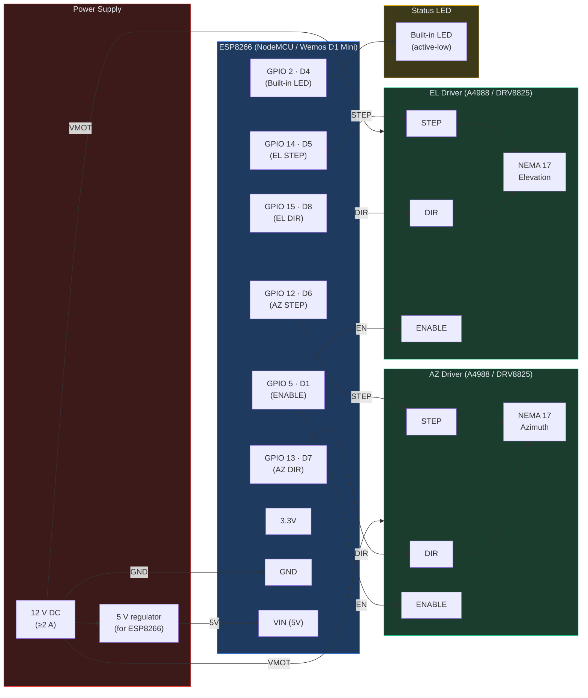

# rotclt — ESP8266 Parabolic Antenna Rotator Controller

**rotclt** is a WiFi-based antenna rotator controller for ESP8266 boards (NodeMCU, Wemos D1 Mini) that drives a two-axis parabolic dish mount using stepper motors. It implements the Hamlib `rotctld` TCP protocol, allowing satellite tracking software like **SatDump** and **Gpredict** to remotely control the dish. It also provides a built-in web interface with interactive 3D visualization.

## Quick Start

1. **Assemble hardware** — connect two NEMA 17 stepper motors to ESP8266 via A4988/DRV8825 drivers (see [Wiring](#wiring)).
2. **Flash firmware** — configure WiFi credentials in [rotclt.ino](rotclt.ino) and upload to ESP8266.
3. **Access web UI** — open `http://<esp-ip>/` in your browser for the 3D control panel.
4. **Point tracking software** — configure SatDump/Gpredict to use `rotctld` at `<esp-ip>:4533`.

---

## Features

| Feature | Details |
|---|---|
| **MCU** | ESP8266 (NodeMCU v1.0 / Wemos D1 Mini) — any ESP-12E/F module |
| **Protocol** | Hamlib `rotctld` TCP server on port **4533** (satellite tracking) |
| **Axes** | Azimuth (0–360°) + Elevation (0–90°) — two independent axes |
| **Actuators** | 2× NEMA 17 stepper motors via step/dir drivers (A4988 or DRV8825) |
| **Motor Specs** | AZ: 55°/s max, 180°/s² accel · EL: 35°/s max, 140°/s² accel |
| **Resolution** | AZ: 0.0133°/step (27,106 steps/rev) · EL: 0.0369°/step (9,743 steps/rev) |
| **Web UI** | Responsive HTTP server (port 80) with interactive Three.js 3D visualization |
| **Real-time Updates** | Position polling every 600 ms |
| **Persistence** | EEPROM storage — offsets, park position, current position auto-saved |
| **Status LED** | Built-in LED with WiFi/connection state patterns |
| **Mobile-Friendly** | Responsive layout for phones, tablets, and desktops |

---

## Hardware Requirements

### Bill of Materials

| Qty | Part | Notes |
|---|---|---|
| 1 | ESP8266 board (NodeMCU v1.0 or Wemos D1 Mini) | Any ESP-12E/F module works |
| 2 | NEMA 17 stepper motor | 1.8°/step, ≥ 0.4 A rated |
| 2 | A4988 or DRV8825 stepper driver | Set to 16× microstepping |
| 1 | 12 V DC power supply | ≥ 2 A for both motors + drivers |
| 1 | 5 V voltage regulator / buck converter | Converts 12 V → 5 V for ESP8266 |
| 2 | 100 µF electrolytic capacitor | One per driver (across VMOT/GND) |
| — | Hookup wire (22 AWG), JST/Dupont connectors | For wiring |

### Wiring

#### GPIO Pin Map

| GPIO | NodeMCU Label | Function |
|---|---|---|
| 2 | D4 | Status LED (active-low, built-in) |
| 5 | D1 | Motor drivers ENABLE (shared) |
| 12 | D6 | Azimuth stepper — STEP |
| 13 | D7 | Azimuth stepper — DIR |
| 14 | D5 | Elevation stepper — STEP |
| 15 | D8 | Elevation stepper — DIR |

#### Schematic



#### Wiring Notes

- **Each stepper driver** needs: STEP, DIR, ENABLE, VMOT (12V), GND, and motor coil connections.
- **Microstepping configuration:**
  - **A4988:** Set all three jumpers HIGH (under the chip) for 16× microstepping.
  - **DRV8825:** M0=LOW, M1=LOW, M2=HIGH for 16× microstepping.
- **ENABLE signal (GPIO 5):** Shared between both drivers — a single HIGH signal enables both motors.
- **Power:**
  - **VMOT** (12 V) is shared between drivers from the main supply (rated ≥2 A).
  - Add a 100 µF electrolytic capacitor across VMOT/GND on each driver for stability.
  - Feed ESP8266 **VIN** from a 5 V buck converter (or linear regulator) off the 12 V rail.
- **GND:** Connect all grounds together — ESP8266, both drivers, and 12 V supply share a common ground.
- **LED:** GPIO 2's built-in LED is active-low — no external resistor needed.

---

## Installation & Setup

### 1. Arduino IDE Board Configuration

1. **File → Preferences** — paste this board manager URL in the field:
   ```
   https://arduino.esp8266.com/stable/package_esp8266com_index.json
   ```

2. **Tools → Board → Boards Manager** — search for `esp8266` and install **esp8266 by ESP8266 Community**.

3. **Tools → Board** — select one of:
   - _NodeMCU 1.0 (ESP-12E Module)_
   - _LOLIN(WEMOS) D1 mini_

4. **Tools → Upload Speed** — set to `115200`.

### 2. Install Required Libraries

1. **Sketch → Include Library → Manage Libraries…**
2. Search and install **AccelStepper** by Mike McCauley.
3. All other libraries (WiFi, WebServer, EEPROM, Wire) are built-in with the ESP8266 board package.

#### Library Dependencies

| Library | Source | Purpose |
|---|---|---|
| `ESP8266WiFi` | Built-in (ESP8266 board) | WiFi connectivity (STA mode) |
| `ESP8266WebServer` | Built-in (ESP8266 board) | HTTP server on port 80 |
| `EEPROM` | Built-in (ESP8266 board) | Offset & park position storage |
| `Wire` | Built-in (ESP8266 board) | I²C (reserved for future use) |
| **AccelStepper** | Library Manager | Stepper motor acceleration profiles |

### 3. Configure & Flash

1. Open [rotclt.ino](rotclt.ino) in Arduino IDE.
2. Locate the WiFi credentials section and update:
   ```cpp
   const char* ssid = "YOUR_SSID";
   const char* password = "YOUR_PASSWORD";
   ```
3. Connect your ESP8266 board via USB.
4. Click **Upload** (or **Sketch → Upload**).
5. Open **Tools → Serial Monitor** (115200 baud) to see boot messages and the device's IP address.

---

## Usage

### Starting the Device

1. **Power on** the assembled rotator — the status LED blinks fast (WiFi search).
2. **Wait for connection** — LED slows to 1 s blink once connected to WiFi.
3. **Find the IP** — check the Serial Monitor (115200 baud) for the assigned IP address, or check your router's DHCP client list.

### Web UI

Open `http://<device-ip>/` in a web browser. You'll see:

- **3D View:** Interactive Three.js visualization of the dish with:
  - **Grey marker** — current position
  - **Gold wireframe** — target position
  - **Green arrow** — direction to target
  - **Compass rose** — azimuth reference
  - **Mouse control** — drag to orbit, scroll to zoom
  
- **Status bar** (top):
  - Current azimuth & elevation
  - Target azimuth & elevation
  - Enable/disable toggle
  - Client connection indicator

- **Control tabs** (mobile bottom bar / desktop left panel):
  - **Position:** View and set AZ/EL with live feedback
  - **Offsets:** Calibrate mechanical AZ/EL offsets (saved to EEPROM)
  - **Manual Control:** D-pad with adjustable step size (0.5°–5°)
  - **Park:** Configure and activate a park position


### Satellite Tracking Software

Configure your tracking software (SatDump, Gpredict, etc.) to use:
- **Host:** `<device-ip>`
- **Port:** `4533`
- **Protocol:** `rotctld` (Hamlib)

---

## API Reference

### Hamlib rotctld Protocol (TCP Port 4533)

#### Position Commands

| Command | Response | Example |
|---|---|---|
| `p` | `AZ EL\n` | `p` → `45.23 30.1\n` |
| `\get_pos` | `AZ EL\n` | `\get_pos` → `45.23 30.1\n` |
| `P AZ EL` | `RPRT 0\n` | `P 90 45` → `RPRT 0\n` |
| `\set_pos AZ EL` | `RPRT 0\n` | `\set_pos 90 45` → `RPRT 0\n` |

#### Device Commands

| Command | Response |
|---|---|
| `_` | `rotclt-esp8266\n` |
| `q` | Close connection |
| `+` (prefix) | Extended format (non-standard) |

### HTTP Endpoints (Port 80)

| Endpoint | Method | Parameters | Returns | Description |
|---|---|---|---|---|
| `/` | GET | — | HTML | Main control panel |
| `/status` | GET | — | JSON | Current state (AZ, EL, offsets, flags) |
| `/setpos?az=NUM&el=NUM` | GET | `az`, `el` | JSON | Set target position |
| `/setoffset?az=NUM&el=NUM` | GET | `az`, `el` | JSON | Set AZ/EL offsets (saved to EEPROM) |
| `/setpark?az=NUM&el=NUM` | GET | `az`, `el` | JSON | Configure park position |
| `/park` | GET | — | JSON | Move to park position |
| `/manual?d=DIR&s=NUM` | GET | `d` (up/down/left/right), `s` (degrees) | JSON | Manual nudge |
| `/enable?v=0\|1` | GET | `v` (0 or 1) | JSON | Enable (1) or disable (0) motors |
| `/calibrate?az=NUM&el=NUM` | GET | `az`, `el` | JSON | Set current position as reference |

**JSON Response Format:**
```json
{
  "az": 45.23,
  "el": 30.1,
  "target_az": 90.0,
  "target_el": 45.0,
  "enabled": true,
  "client_connected": false,
  "az_offset": 0.0,
  "el_offset": 0.0,
  "park_az": 0.0,
  "park_el": 0.0
}
```

---

## Architecture & Design

The firmware is organized as a modular, object-oriented system with a thin orchestrator sketch.

### Module Breakdown

```
rotclt.ino                    ← Main sketch: setup() and loop() orchestrator (~80 lines)
│
├── AppState.h                ← Shared state struct (positions, offsets, flags)
│                              All modules reference this, avoiding globals
│
├── Logger.h / .cpp           ← Static logging class with level filtering
│                              Replaces all Serial.println calls
│                              Tagged output: [INF][WIFI] Connected
│
├── AngleUtils.h              ← Header-only angle math library
│                              normalize(), clamp(), shortestDelta(), etc.
│
├── WifiManager.h / .cpp      ← WiFi connection lifecycle
│                              Scan, connect, retry logic
│
├── LedIndicator.h / .cpp     ← Non-blocking LED blink patterns
│                              WiFi search (400 ms), idle (1000 ms), client (80 ms)
│
├── MotorDriver.h / .cpp      ← AccelStepper wrapper
│                              Dual-axis control with acceleration profiles
│
├── OffsetStore.h / .cpp      ← EEPROM persistence
│                              Offsets, park position, current position
│
├── RotctlService.h / .cpp    ← Hamlib rotctld TCP server (port 4533)
│                              Command parser, position queries, client handling
│
├── HttpHandler.h / .cpp      ← HTTP route handlers (port 80)
│                              /status, /setpos, /setoffset, /park, /manual, /enable
│
├── WebUi.h / .cpp            ← HTML/CSS/JS page generation
│                              Inlines Three.js, generates interactive 3D view
│
├── index.html                ← Standalone test page (browser-only, no ESP)
│
├── ihm.png                   ← UI screenshot
└── README.md                 ← This file
```

### Key Design Decisions

1. **Shared `AppState` struct** — Passed by reference to all modules, avoiding globals and reducing coupling.
   
2. **`Logger` static class** — All output goes through leveled logging with tags:
   ```
   [DBG][WIFI] Scanning networks...
   [INF][HTTP] GET /status from 192.168.1.50
   [WRN][MOTOR] Position out of bounds: 400°
   [ERR][EEPROM] Write failed at offset 0x10
   ```

3. **`AngleUtils` header-only namespace** — Eliminates duplicated angle math (normalize, wrapping, shortest path).

4. **Position auto-save to EEPROM** — Current AZ/EL written every 5 seconds if position changed ≥ 0.1°, extending flash life.

5. **Non-blocking everything** — LED blinks, WiFi scans, motor acceleration all use time checks, not `delay()`.

6. **AccelStepper trapezoidal profiles** — Smooth acceleration/deceleration prevents mechanical shock.

### Motor Specifications

| Axis | Motor | Gear Ratio | Max Speed | Accel | Resolution |
|---|---|---|---|---|---|
| **Azimuth** | NEMA 17 (200 steps) | 144:17 | 55°/s | 180°/s² | 0.0133°/step |
| **Elevation** | NEMA 17 (200 steps) | 64:21 | 35°/s | 140°/s² | 0.0369°/step |

---

## LED Status Patterns

| Pattern | Meaning |
|---|---|
| **Fast blink** (400 ms) | Searching for WiFi |
| **Slow blink** (1000 ms) | WiFi connected, idle (no active client) |
| **Rapid pulse** (80 ms) | rotctld client connected |

---

## Troubleshooting

### Device won't connect to WiFi

1. **Check credentials** — Verify SSID and password are correct in [rotclt.ino](rotclt.ino).
2. **Check Serial Monitor** — Open Tools → Serial Monitor (115200 baud) to see boot messages.
3. **Check DHCP** — Ensure router is in range and DHCP is enabled.
4. **Check antenna** — If using a Wemos D1 Mini without an antenna, WiFi signal may be weak.

### Stepper motors don't move

1. **Check power** — Verify 12 V supply is connected and ≥2 A capacity.
2. **Check wiring** — Verify GPIO pins match the schematic (D1 for enable, D6/D7 for AZ, D5/D8 for EL).
3. **Check microstepping** — Set A4988/DRV8825 jumpers to 16× (see [Wiring](#wiring)).
4. **Check `enable`** — Use web UI to toggle **Enable** on/off.
5. **Check motor power** — Test with a multimeter; VMOT should show 12 V.

### Web UI doesn't load

1. **Check IP address** — Open Serial Monitor to find the device's IP.
2. **Check firewall** — Ensure ESP8266 is on the same WiFi network as your device.
3. **Check port 80** — Verify nothing else is running on port 80 on the network.

### Position drifts or is inaccurate

1. **Calibrate offsets** — Use the web UI's **Offsets** tab to set AZ/EL mechanical offsets.
2. **Check load** — Ensure the dish mount isn't under extreme strain (loose bearings, misalignment).
3. **Check microstepping** — Incorrect jumper settings cause missed steps.

### Satellite tracking software can't connect

1. **Check IP and port** — Verify tracking software is configured for `<ip>:4533`.
2. **Check protocol** — Ensure tracking software is using `rotctld` (Hamlib), not another protocol.
3. **Check ESP8266 firewall** — Some networks block non-standard ports; try connecting from the same machine as a test.
4. **Monitor connection** — The LED should pulse at 80 ms when a client connects; check Serial Monitor for connection logs.

---

## Testing Without Hardware

To test the web UI without an ESP8266, simply open [index.html](index.html) in a web browser. You'll see the 3D visualization and controls (though position updates will be simulated/static).

---

## Project Structure

```
rotclt/
├── rotclt.ino                 Main sketch (setup + loop)
├── AppState.h                 Shared state struct
├── AngleUtils.h               Angle math utilities (header-only)
├── Logger.h / .cpp            Leveled logging class
├── WifiManager.h / .cpp       WiFi connection lifecycle
├── LedIndicator.h / .cpp      Status LED patterns
├── MotorDriver.h / .cpp       Dual-axis stepper control
├── OffsetStore.h / .cpp       EEPROM persistence
├── RotctlService.h / .cpp     Hamlib rotctld TCP server
├── HttpHandler.h / .cpp       HTTP route handlers
├── WebUi.h / .cpp             HTML/CSS/JS UI generation
├── index.html                 Standalone test page
├── ihm.png                    UI screenshot
└── README.md                  This file
```

---

## Contributing

Contributions are welcome! Areas for improvement:

- **Calibration wizard** — Automated mechanical offset detection.
- **EEPROM diagnostics** — Display wear leveling stats.
- **PID tuning** — Dynamic speed/acceleration profiles.
- **Mobile app** — Native Android/iOS remote control.
- **Home assistant integration** — MQTT support for home automation.

---

## License

This project is provided as-is for educational and amateur radio use.
