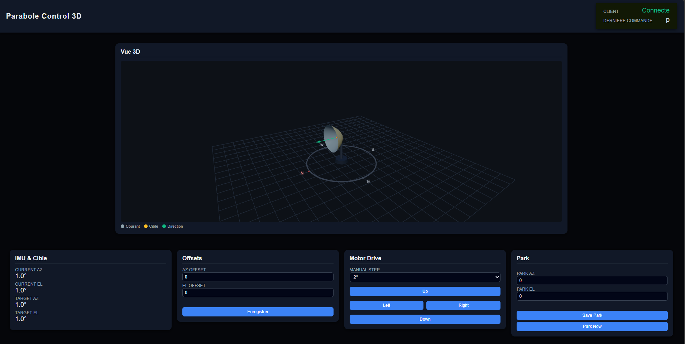
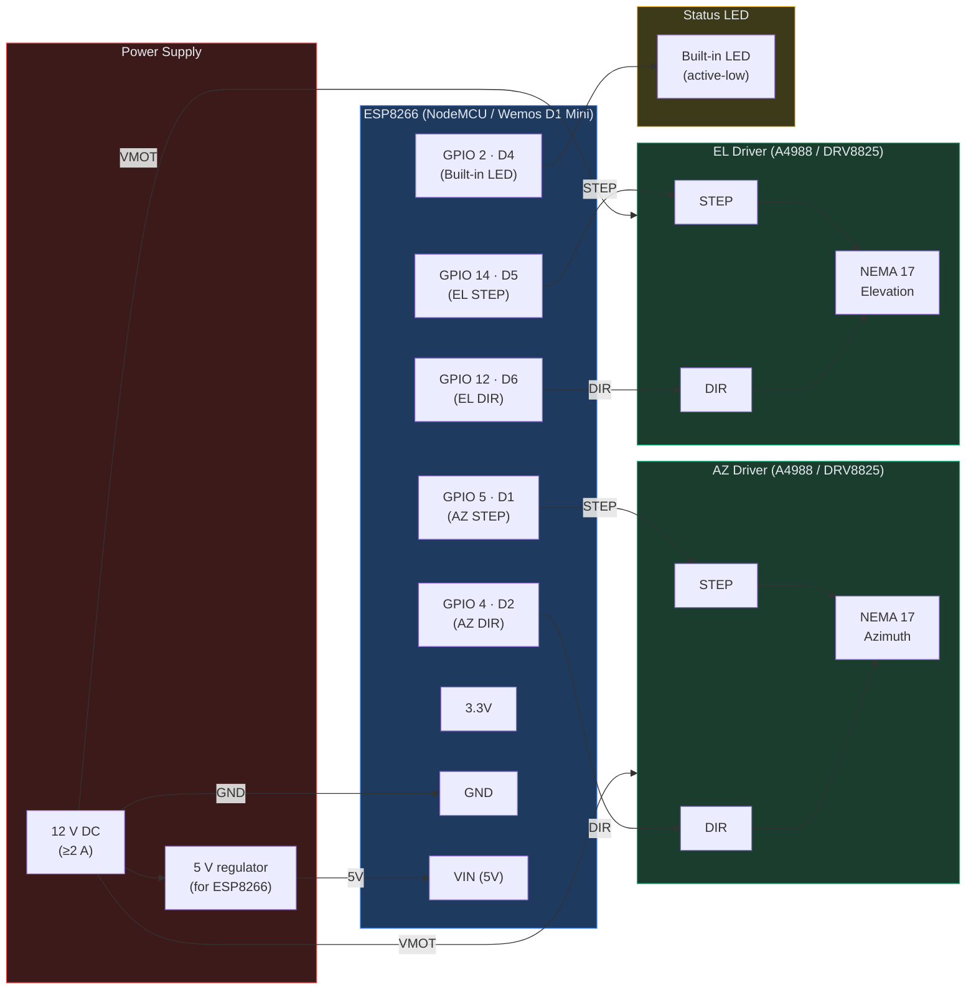

# rotclt — ESP8266 Parabolic Antenna Rotator Controller

An ESP8266-based antenna rotator controller that implements the **Hamlib rotctld** TCP protocol, enabling satellite tracking software (SatDump, Gpredict, etc.) to drive a two-axis stepper-motor dish mount over WiFi.

## Overview

| Feature | Details |
|---|---|
| **MCU** | ESP8266 (NodeMCU / Wemos D1 Mini) |
| **Protocol** | Hamlib `rotctld` on TCP port **4533** |
| **Axes** | Azimuth (0–360°) + Elevation (0–90°) |
| **Actuators** | 2× NEMA 17 stepper motors via step/dir drivers (A4988 / DRV8825) |
| **Resolution** | AZ: 27 106 steps/rev (0.0133°/step), EL: 9 743 steps/rev (0.0369°/step) |
| **Web UI** | Built-in HTTP server on port 80 with interactive 3D view |
| **Storage** | EEPROM — persists AZ/EL offsets and park position |
| **LED** | Status indicator (WiFi search / idle / client connected) |

### Supported rotctld Commands

| Command | Description |
|---|---|
| `p` / `\get_pos` | Get current azimuth & elevation |
| `P az el` / `\set_pos az el` | Set target position |
| `_` | Get device info (`rotclt-esp8266`) |
| `q` | Quit / disconnect |
| `+` prefix | Extended response format |

### Motor Control

The motor driver uses the **AccelStepper** library with trapezoidal velocity profiles for smooth acceleration/deceleration:

| Axis | Max Speed | Acceleration | Steps/rev |
|---|---|---|---|
| **Azimuth** | 55°/s | 180°/s² | 27 106 |
| **Elevation** | 35°/s | 140°/s² | 9 743 |

Stepper configuration: NEMA 17 (200 full steps/rev) with 16× microstepping on A4988 or DRV8825 driver boards, with gear ratios AZ 144:17, EL 64:21.

### LED Status Patterns

| Pattern | Meaning |
|---|---|
| Fast blink (400 ms) | Searching for WiFi |
| Slow blink (1000 ms) | Idle — WiFi connected, no client |
| Rapid pulse (80 ms) | rotctld client connected |

---

## Web UI Preview

The built-in web interface serves an interactive **Three.js 3D visualization** of the dish with real-time position updates (polled every 600 ms).

### UI Panels

| Panel | Function |
|---|---|
| **Vue 3D** | Interactive Three.js scene — parabolic dish on a mast with compass rose, current position (grey), target position (gold wireframe), and direction arrow (green). Supports mouse orbit/zoom. |
| **IMU & Cible** | Displays current and target azimuth/elevation in real time. |
| **Offsets** | Set AZ/EL calibration offsets (saved to EEPROM). |
| **Motor Drive** | Manual nudge buttons (Up/Down/Left/Right) with selectable step size (0.5°–5°). |
| **Park** | Configure and trigger a park position. |

### HTTP Endpoints

| Endpoint | Method | Description |
|---|---|---|
| `/` | GET | Serve the main HTML page |
| `/status` | GET | JSON with all current state |
| `/setoffset?az=&el=` | GET | Set AZ/EL offsets |
| `/setpark?az=&el=` | GET | Set park position |
| `/park` | GET | Move to park position |
| `/manual?d=&s=` | GET | Manual nudge (`d`=up/down/left/right, `s`=step degrees) |

---

## Schematic

### Pin Map

| GPIO | NodeMCU Label | Function |
|---|---|---|
| 2 | D4 | Status LED (active-low, built-in on most boards) |
| 5 | D1 | Azimuth stepper — STEP |
| 4 | D2 | Azimuth stepper — DIR |
| 14 | D5 | Elevation stepper — STEP |
| 12 | D6 | Elevation stepper — DIR |

### Wiring Notes

- Each stepper driver (A4988 or DRV8825) needs **STEP**, **DIR**, **VMOT**, **GND**, and motor coil connections. Set the microstepping jumpers to **16×** (all three jumpers HIGH on A4988; M0=low M1=low M2=high on DRV8825).
- **VMOT** is powered from a **12 V** supply rated for at least 2 A (both drivers share it). A 100 µF electrolytic capacitor across VMOT/GND on each driver is recommended.
- Feed the ESP8266 through **VIN** from a 5 V regulator (or buck converter) off the 12 V rail.
- The built-in LED on GPIO 2 is active-low — no external resistor needed.
- **Share a common GND** between the ESP8266, both drivers, and the 12 V supply.

---

## Bill of Materials

| Qty | Part | Notes |
|---|---|---|
| 1 | ESP8266 board (NodeMCU v1.0 or Wemos D1 Mini) | Any ESP-12E/F module works |
| 2 | NEMA 17 stepper motor | 1.8°/step, ≥ 0.4 A rated |
| 2 | A4988 or DRV8825 stepper driver | Set to 16× microstepping |
| 1 | 12 V DC power supply | ≥ 2 A for both motors |
| 1 | 5 V voltage regulator / buck converter | Powers the ESP8266 from 12 V |
| 2 | 100 µF electrolytic capacitor | One per driver, across VMOT/GND |
| — | Hookup wire, connectors | — |

---

## Building & Flashing

### Board Setup (Arduino IDE)

1. **File → Preferences** — add the ESP8266 board manager URL:  
   `https://arduino.esp8266.com/stable/package_esp8266com_index.json`
2. **Tools → Board → Boards Manager** — search `esp8266` and install **esp8266 by ESP8266 Community**.
3. **Tools → Board** — select _NodeMCU 1.0 (ESP-12E Module)_ or _LOLIN(WEMOS) D1 mini_.
4. **Tools → Upload Speed** — 115200.

### Install Libraries

1. **Sketch → Include Library → Manage Libraries…**
2. Search and install **AccelStepper** by Mike McCauley.

### Flash

1. Edit the WiFi credentials in [rotclt.ino](rotclt.ino) (`ssid` / `password`).
2. Connect the board via USB and click **Upload**.

### Dependencies

| Library | Source | Notes |
|---|---|---|
| `ESP8266WiFi` | Built-in (ESP8266 board package) | WiFi STA mode |
| `ESP8266WebServer` | Built-in | HTTP server on port 80 |
| `Wire` | Built-in | I²C (reserved, not currently used) |
| `EEPROM` | Built-in | Offset & park position storage |
| **AccelStepper** | Library Manager | Stepper motor control with acceleration |

---

## Usage

1. Power on the ESP8266 — the LED blinks fast while connecting to WiFi.
2. Once connected, the LED slows to a 1 s blink. Find the IP on Serial (115200 baud).
3. Open `http://<ip>/` in a browser for the 3D control panel.
4. Point your tracking software (SatDump, Gpredict, etc.) at `<ip>:4533` using the rotctld protocol.
